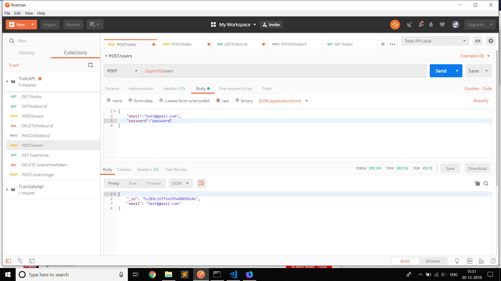
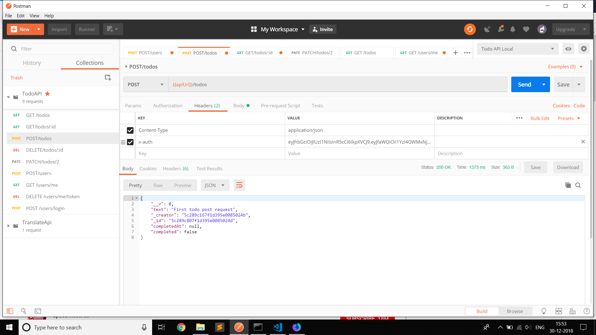
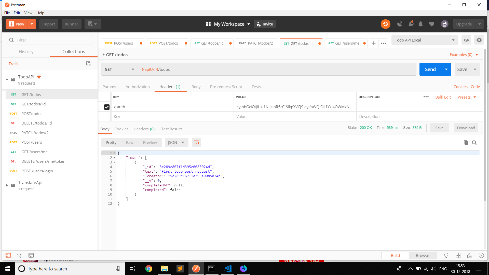
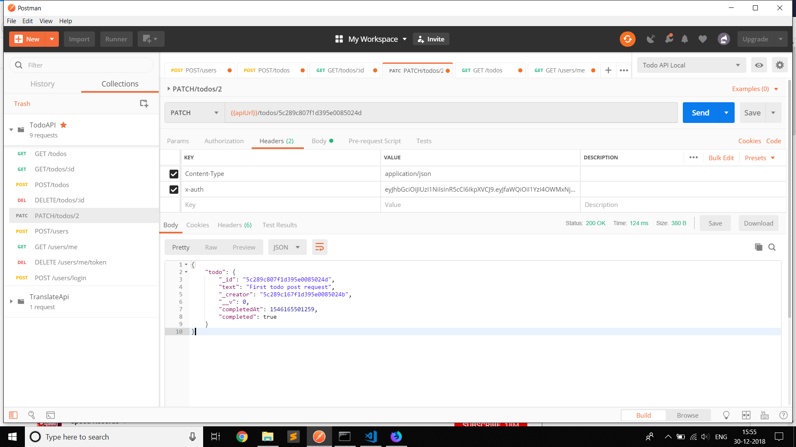

# TODO-API 
 Written completely in node js, this api makes the user making a todoApp easier by doing all the saving , getting and deleting the todos with just using an api call.

It uses mongodb database for storing the api and bcryptJS for hashing password before storing 

## Documentation
  
  1. First of all clone the rep using git cone <.git url of repo>
  2. Move in the repo using cd node-todo-api

### Creating a config.json file
  1. Make a config.json file right beneath the config.js file
  Your file should look like this

  {
	"test":{
     "PORT": 3000,
     "MONGODB_URI":"mongodb://localhost:27017/TodoAppTest",
     "JWT_SECRET" :"YOUR_SECRET"
	},
	"development":{
     "PORT": 3000,
     "MONGODB_URI":"mongodb://localhost:27017/TodoApp",
     "JWT_SECRET" :"YOUR_SECRET"
	}
}

2. For production make sure you have a MONGODB_URI and JWT_SECRET in you app config vars...

### Creating a USER
1. In order to create a todo you have to create a user profile 
  To do so make a POST request to /users with req.body consisting of email and password 
  

2. Get the x-auth from the header . This would be used everywhere  as authentication.
 

3.  To login into your account make a post request to /users/login with your email and password

### Creating todos 

1.  Make a POST request to /todos with req object having atleast text property.

### Getting todos 

1.  Make a GET request to /todos 

### Editing todos 

1.  Make a PATCH request to /todos/id with req object having property you want to edit

### Deleting todos 

1.  Make a DELETE request to /todos/id 

